# Mule Demo - API Design & Implementation Exercise

This README includes a short introduction of design and Implement REST APIs by using RAML and MuleSoft.

## Prerequisites

You will need the following things properly installed on your computer.

* [Git](http://git-scm.com/)
* [mysql](https://www.mysql.com/)
* [RAML API Workbench](http://apiworkbench.com/)
* [Anypoint Studio](https://www.mulesoft.com/platform/studio)
* [JDK 8](http://www.oracle.com/technetwork/java/javase/downloads/jdk8-downloads-2133151.html)
* [Maven 3.5.3](https://maven.apache.org/download.cgi)
* [MySQL JDBC Driver](https://dev.mysql.com/downloads/connector/j/5.1.html)
* [Postman](https://www.getpostman.com/)

## Installation

* Install Mysql and import the scripts under the `src/main/resources/demo.sql`
* `git clone <repository-url>` this repository
* Import Demo into the Mulesoft Anypoint Studio (Find Maven pom file)
* If not use `Maven` need to manually add the MySQL JDBC Driver to the project.
* Change the database properties in the file `mule-app.properties`
* Turn on Debug ```<AsyncLogger name="org.mule.api.processor.LoggerMessageProcessor" level="DEBUG"/>```


## Running / Development

* Run as Mule Application with maven
* Visit your application at [http://localhost:8081/console](http://localhost:8081/console).

### Implement List Customers Flow include Pagination, Filters
In this Flow Filtering customers by different type of criteria and build Dynamic Query.
* Expression Component build Dynamic SQL Query.
* Customer Transformer build MySQL Pagination.
* Logger Component logging SQL info for Debug purpose.
* Retrieve the records from the database.
* DataWeave Transformer transform the records to json format.

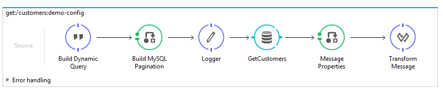

### Implement Get Specific Customer Flow
* Query Database by specific ID
* Choice Component check if the customer found in the database.
* Property Component set the `http status 404` if customer not found.
* DataWeave Transformer transform the found record to json format.

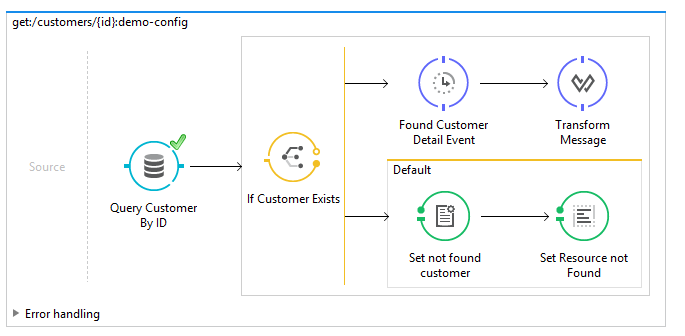

### Implement Create Customer Flow
* Insert the customer in the DB.
* return the customer plus the id as a response

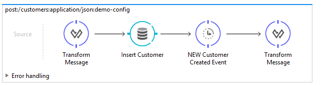

### Implement Delete Customer Flow
* Query Database by specific ID
* Choice Component check if the customer found in the database.
* Property Component set the `http status 404` if customer not found.
* Delete customer if found.

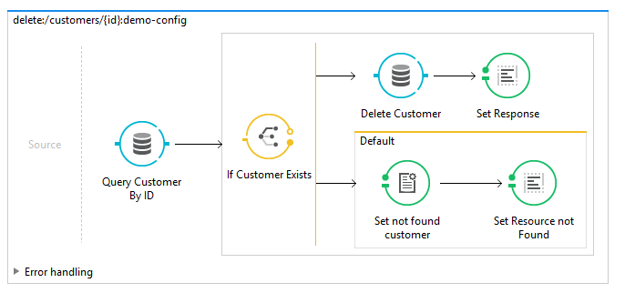

### Implement Update Customer Flow
* Query Database by specific ID
* Choice Component check if the customer found in the database.
* Property Component set the `http status 404` if customer not found.
* Update the customer if exist.

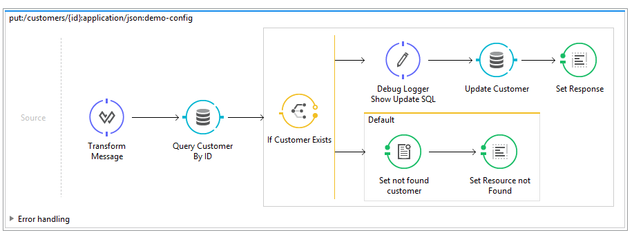
### Unit Test
* Munit
* Mock up service by using mock Component, etc mock database results
* Verification
* Choice 100% coverage
* Exception Handling - User not found, return `404`

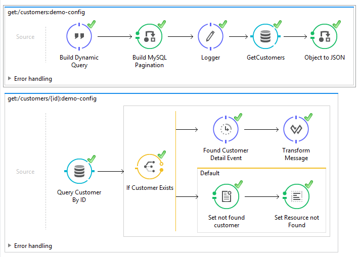

### Other Testing
* List Customers - ```http://127.0.0.1:8081/api/customers?offset=0&limit=2&startdate=2018-04-01&enddate=2018-10-01```
  - offset: Specify the page number that you want to retrieve
  - limit: Specify The number of rows in a page request

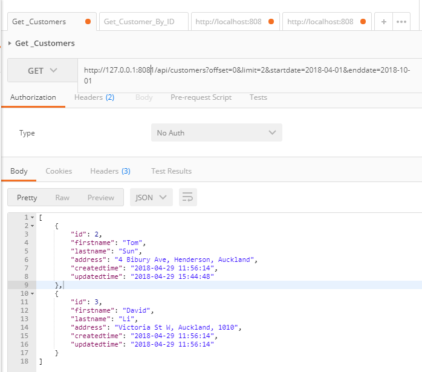

* To Create a Customer - ```http://localhost:8081/api/customers```
  - Http headers: Content-Type: application/json
  - Http body:
  ```
  {
  "firstname": "David",
  "lastname": "Li",
  "address": "4 Bibury Ave, Henderson, Auckland"
  }
  ```
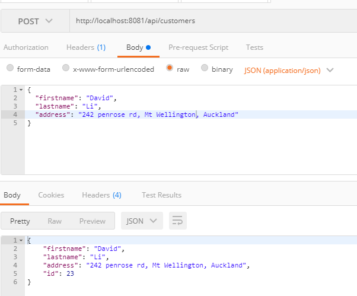

* Get a Customer - ```http://127.0.0.1:8081/api/customers/{id}```
  - id: the `{id}` is the customer's identity

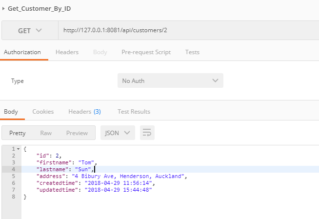

* Update a Customer - ```http://127.0.0.1:8081/api/customers/{id}```
  - Http headers: Content-Type: application/json
  - Payload :
  ```
  {
    "firstname": "Tom",
    "lastname": "Sun",
    "address": "242 Penrose Rd, Henderson, Auckland"
  }
  ```

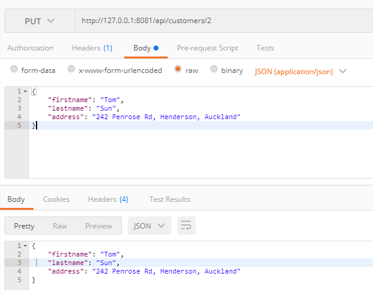

* Delete a Customer - ```http://127.0.0.1:8081/api/customers/{id}```
  - id: the `{id}` is the customer's identity

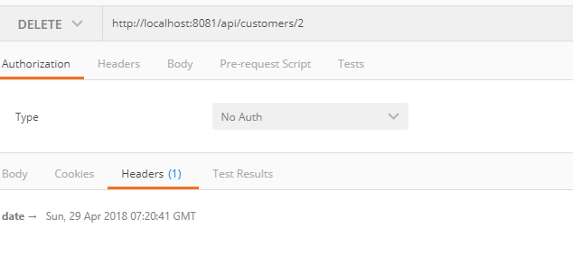

## Further Reading / Useful Links

* API security
* Sub-Flow etc
